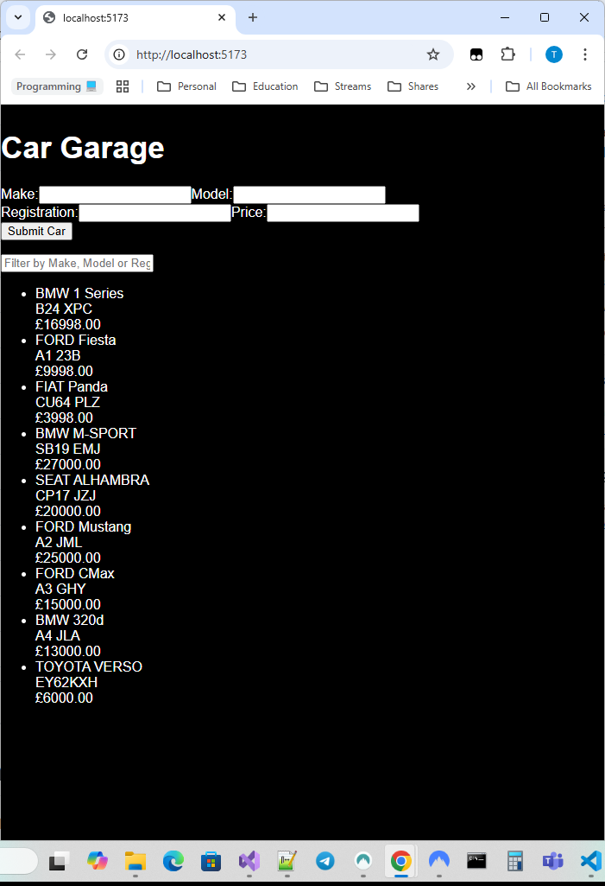

# Car Garage Management App

This is a simple **React + TypeScript** application built with **Vite**. The project manages a car garage, allowing users to add, filter, and view cars.

## Features

- **Add New Cars**: Users can input car details such as Make, Model, Registration, and Price.
- **Filter Cars**: Filter cars based on specific criteria like Make or Model.
- **View Car List**: A formatted display of all cars in the inventory, showing their details.
- **Modern UI**: Built with React, styled for clarity and ease of use.

## Preview



## Technologies Used

- **React**: Frontend framework.
- **TypeScript**: For static typing and improved developer experience.
- **Vite**: Fast development environment.
- **CSS**: For styling components.
- **Testing Library**: For unit testing components.
- **Jest**: For running tests.

## Installation

To run the application locally, follow these steps:

1. **Clone the Repository**:
   ```bash
   git clone https://github.com/arshadte/car-garage.git
   cd car-garage-app
   ```

2. **Install Dependencies**:
   ```bash
   npm install
   ```

3. **Run the Development Server**:
   ```bash
   npm run dev
   ```

4. Open your browser and navigate to `http://localhost:5173`.

## Testing

This project includes unit tests to ensure the functionality of key components like `AddCarForm` and `CarList`.

### Running the Tests

To run the tests:

1. Ensure all dependencies are installed:
   ```bash
   npm install
   ```

2. Run the test suite:
   ```bash
   npm test
   ```

3. To run tests with coverage reports:
   ```bash
   npm test -- --coverage
   ```

This will display the test results and generate a coverage report showing which parts of the code are tested.

### Writing Tests

Tests are written using:
- **Jest**: For running the tests.
- **React Testing Library**: For testing React components.

Test files are located in the `src/components` directory, alongside their corresponding components. For example:
- Component: `AddCarForm.tsx`
- Test file: `AddCarForm.test.tsx`

### Debugging Tests

If you encounter errors during testing:
1. Ensure the component file paths are correct in the test files.
2. Verify that `@testing-library/react` and `jest` are properly installed in `package.json`.
3. Check the console output for detailed error messages.

For more advanced debugging, you can run tests in watch mode:
```bash
npm test -- --watch
```

## License

This project is licensed under the [MIT License](LICENSE).

---

